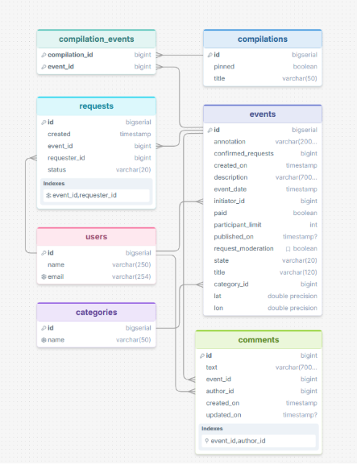

# Explore With Me 🎉

**Explore With Me** — это приложение-афиша, которое помогает пользователям делиться информацией о интересных событиях (от выставок до походов в кино) и находить компанию для совместного участия. Проект решает проблему сложного планирования досуга, объединяя поиск мероприятий и общение в одном месте.

---

## 🏗️ Архитектура проекта

Проект построен на базе **Spring Boot 3** и имеет многомодульную структуру Maven для обеспечения слабой связности компонентов:

- **`main-service`** — основной сервис, предоставляющий публичный, приватный и административный API для управления событиями, пользователями и категориями.
- **`stats`** — модуль статистики, состоящий из трёх подмодулей:
    - `stats-dto` — общие классы для передачи данных (Data Transfer Objects).
    - `stats-server` — HTTP-сервис для сбора и агрегации статистики просмотров.
    - `stats-client` — HTTP-клиент для взаимодействия основного сервиса со сервисом статистики.

---

## 🗄️ Схема базы данных



### Основные сущности:
- **users** — пользователи системы (инициаторы событий и участники)
- **categories** — категории событий (уникальные названия)
- **events** — центральная сущность: мероприятия с геолокацией, лимитами участников и модерацией
- **compilations** — подборки событий (курируемый контент)
- **requests** — заявки на участие в событиях со статусами (PENDING/CONFIRMED/REJECTED)
- **compilation_events** — связующая таблица для связи многие-ко-многим между подборками и событиями

### 🔑 Ключевые особенности модели данных:
- **Денормализация**: поле `confirmed_requests` в таблице `events` для оптимизации производительности
- **Уникальные ограничения**: email пользователя, название категории, уникальность заявки (event_id + requester_id)
- **Индексы**: на полях частого поиска (state, category_id, initiator_id, event_date)
- **Каскадное удаление**: при удалении события удаляются связанные заявки

---

## 📊 Этап 1: Сервис статистики (Реализовано ✅)

На текущем этапе полностью реализован и протестирован сервис статистики в соответствии со спецификацией `ewm-stats-service.json`.

### 🔹 Функционал
- **Сбор данных (`POST /hit`)**: Сохранение информации о каждом обращении к публичным эндпоинтам основного сервиса (URI, IP-адрес, время, название сервиса).
- **Аналитика (`GET /stats`)**: Выгрузка статистики просмотров за заданный период времени.
    - Фильтрация по конкретному списку URI.
    - Поддержка подсчёта как **общего количества просмотров**, так и **количества уникальных посещений** (по уникальным IP-адресам).
    - Сортировка результатов по убыванию количества просмотров.

### 🔹 Техническая реализация
- Агрегация данных (`COUNT` и `COUNT(DISTINCT)`) вынесена на уровень базы данных с помощью **JPQL** для максимальной производительности.
- Инициализация схемы БД происходит автоматически при старте через `schema.sql`.
- Настроен **Spring Boot Actuator** для мониторинга состояния приложения (`/actuator/health`).
- Полная контейнеризация: сервис и база данных запускаются через `docker-compose`.

---

## 🎯 Этап 2: Основной сервис (Реализовано ✅)

Полностью реализован основной сервис с тремя типами API в соответствии со спецификацией OpenAPI.

### 🔹 Admin API (11 эндпоинтов)
**Управление системой:**
- **Пользователи**: создание, получение списка, удаление
- **Категории**: создание, редактирование, удаление (с проверкой на наличие событий)
- **Подборки событий**: создание, редактирование, удаление, закрепление на главной
- **Модерация событий**: публикация или отклонение событий, изменение любых полей

### 🔹 Private API (9 эндпоинтов)
**Для авторизованных пользователей (инициаторов событий):**
- **События**: создание, редактирование (только в статусах PENDING/CANCELED), получение своих событий
- **Заявки на участие**: подача заявки, отмена своей заявки, получение своих заявок
- **Управление заявками**: получение списка заявок на своё событие, подтверждение/отклонение заявок (с учётом лимита участников)

### 🔹 Public API (6 эндпоинтов)
**Для всех пользователей (без авторизации):**
- **События**: поиск с фильтрацией (по тексту, категориям, платности, датам, доступности), сортировка (по дате или просмотрам)
- **Категории**: получение списка категорий, получение категории по ID
- **Подборки**: получение списка подборок (с фильтром по закреплённым), получение подборки по ID

### 🔹 Техническая реализация
- **Динамическая фильтрация**: использование **Spring Data JPA Specifications** для сложных запросов с множеством опциональных параметров
- **Пагинация**: кастомная реализация через параметры `from` и `size`
- **Интеграция со статистикой**: автоматический подсчёт `views` через `stats-client` для каждого события
- **Жизненный цикл событий**: строгая валидация статусов (PENDING → PUBLISHED/CANCELED)
- **Глобальная обработка ошибок**: `@ControllerAdvice` с форматом ответа, соответствующим спецификации
- **Валидация**: `@Valid` + кастомные проверки бизнес-логики (дата события не раньше чем через 2 часа, уникальность email и т.д.)

---

## 🚀 Планируемая дополнительная функциональность (Этап 3)

Для расширения базового функционала выбрана фича: **💬 Комментарии к событиям**.

**Почему этот выбор:**
Это наиболее предсказуемая и легко тестируемая функция, которая органично дополняет взаимодействие пользователей с событиями, не усложняя базовую бизнес-логику и жизненный цикл мероприятий.

**Планируемый scope реализации:**
1. Возможность авторизованным пользователям оставлять текстовые комментарии к опубликованным событиям.
2. Просмотр списка комментариев к событию (публичный эндпоинт).
3. Возможность удаления комментария его автором или администратором (модерация).
4. Валидация: проверка на пустоту и ограничение максимальной длины текста.

## 🧪 Тестирование функциональности комментариев

### Подготовка
Перед запуском тестов очистите базу данных:
```bash
docker-compose down -v
docker-compose up --build -d
```

---

## 🛠️ Стек технологий

- **Язык**: Java 21
- **Фреймворк**: Spring Boot 3.3.2 (Web, Data JPA, Validation, Actuator)
- **База данных**: PostgreSQL 16.1
- **Сборка**: Maven (многомодульный проект)
- **Контейнеризация**: Docker, Docker Compose
- **Утилиты**: Lombok, Jackson, SLF4J

---

## 🚀 Как запустить проект

### 1. Предварительные требования
- Установлены **Java 21** и **Maven**.
- Установлен **Docker** и **Docker Compose**.

### 2. Сборка проекта
Выполните в корневой директории проекта:
```bash
mvn clean install
```

## Ссылка на Pull Request
[feature_comments → main](https://github.com/Yanok755/java-explore-with-me/pull/9)
